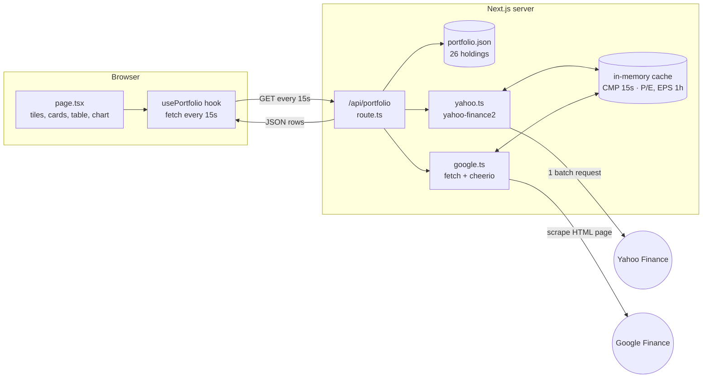

# 8byte - Portfolio Dashboard

A dashboard for my stock portfolio. Holdings are taken from my Excel sheet, but the
current price, P/E ratio and earnings are fetched live.

## Features

- CMP (current market price) from Yahoo Finance using `yahoo-finance2`
- P/E ratio and latest earnings (EPS) scraped from Google Finance using `cheerio`
- Prices refresh automatically every 15 seconds
- Stocks grouped by sector with sector subtotals and a grand total
- Gain/Loss shown in green or red
- Summary tiles (total invested, current value, gain/loss, best and worst stock)
- Sector cards and a donut chart for allocation
- Live indicator, a 15 second countdown bar, and prices flash green/red when they change
- Dark / light mode (remembers your choice)

## Tech Stack

- Next.js (App Router) + TypeScript
- TanStack Table for the table
- Recharts for the donut chart
- Tailwind CSS for styling

## How it works



1. The page calls `/api/portfolio` every 15 seconds.
2. The API route reads the holdings and asks Yahoo (CMP) and Google (P/E, EPS) in parallel.
3. Both fetchers check the cache first, so Yahoo is hit at most every 15 seconds and Google once an hour per stock.
4. The route returns clean JSON, and the browser calculates investment, gain/loss and sector totals.

## Folder structure

```
data/portfolio.json           holdings from the Excel sheet
types/portfolio.ts            TypeScript types
lib/yahoo.ts                  gets CMP for all symbols
lib/google.ts                 scrapes P/E, EPS (and a backup price) for one symbol
lib/cache.ts                  simple in-memory cache with TTL
lib/calculations.ts           investment, present value, gain/loss, sector totals
lib/format.ts                 number formatting and green/red colors
app/api/portfolio/route.ts    API route that combines everything
components/PortfolioTable.tsx main table
components/SectorSummary.tsx  sector cards and subtotal rows
components/SectorChart.tsx    donut chart
components/SummaryTiles.tsx   top summary tiles
components/LiveHeader.tsx     header with live status and countdown
components/ThemeToggle.tsx    dark / light switch
hooks/usePortfolio.ts         fetches data every 15 seconds
```

## Running locally

```bash
npm install
npm run dev
```

Open http://localhost:3000

## Notes

- Yahoo and Google don't have official free APIs, so if a value can't be fetched it shows `-`.
- If Google Finance fails for a stock, P/E and EPS fall back to Yahoo's values.
- LTI Mindtree is now listed as `LTM` on NSE, so that symbol is used.
- Savani Financials (now called Mantra Capital) is not on Yahoo, so its price is taken from Google Finance instead.
- Outside market hours (9:15 AM to 3:30 PM IST, Monday to Friday) prices don't move. The page shows a "Market closed" badge then.

See [TECHNICAL.md](TECHNICAL.md) for the challenges I ran into and how I solved them.
